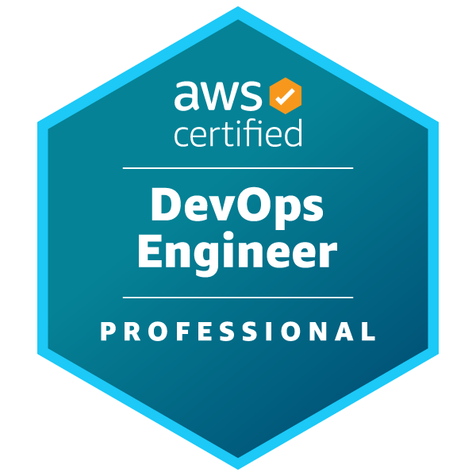

# AWS DevOps Professional Notes

## Table of Contents
- [SDLC Automation](/1.SDLC%20Automation.md)
- [Configuration Management and IaC](/2.Configuration%20Management%20and%20IaC.md)
- [Resilient Cloud Solutions](/3.Resilient%20Cloud%20Solutions.md)
- [Monitoring and Logging](/4.Monitoring%20and%20Logging.md)
- [Incident and event response](/5.Incident%20and%20event%20response.md)
- [Security and Compliance](/6.Security%20and%20Compliance.md)
- [More AWS Services to Focus](/7.More%20AWS%20Services%20to%20Focus.md)
- [AWS Cheatsheet](/8.%20AWS%20Cheatsheet.md)

## Exam Tips

- Understand the core AWS services, especially those related to computing, storage, and networking.
- Know how to secure your AWS environment using IAM roles, policies, and best practices.
- Be familiar with the AWS Well-Architected Framework to build secure, high-performing, resilient, and efficient infrastructure.
- Practice with AWS Free Tier to gain hands-on experience.
- Use AWS documentation and whitepapers as they are excellent resources for deepening your understanding and preparing for the exam.

## Common Pitfalls
 - Don't use Exam Dumps 

## Courses

### Stephane Maarek's AWS Certified DevOps Engineer Professional Course
- **Description**: Stephane Maarek's course is renowned for its comprehensive coverage of all the exam objectives, detailed explanations, and practical insights. Ideal for beginners and experienced professionals alike.
- **Platform**: [Udemy](https://www.udemy.com/course/aws-certified-devops-engineer-professional-hands-on/)
- **Instructor**: Stephane Maarek

## Labs

### CloudAcademy Labs for AWS DevOps Professional
- **Description**: CloudAcademy offers hands-on labs specifically tailored for the AWS DevOps Professional certification. These labs provide practical experience with AWS services and DevOps practices.
- **Platform**: [CloudAcademy - AWS DevOps Labs](https://cloudacademy.com/learning-paths/aws-devops-engineer-professional-dop-c02-certification-preparation-for-aws-1-9637/?program=1acec0f4-f7a7-44b8-9768-ad8792c9ba6d)

## Practice Exams

### Dojo Tutorials Practice Exam Papers
- **Description**: Dojo Tutorials offers a set of practice exams that mimic the format and difficulty level of the actual AWS DevOps Professional certification exam. Great for assessing your readiness and familiarizing yourself with the exam structure.
- **Platform**: [Dojo Tutorials - AWS DevOps Professional Practice Exams](https://tutorialsdojo.com/aws-certified-devops-engineer-professional/)

## Additional Resources

- **AWS Official Documentation**: Deep dive into the [AWS Documentation](https://docs.aws.amazon.com/) to understand the intricacies of each service covered in the exam.
- **AWS Whitepapers and Guides**: Explore the [AWS Whitepapers](https://aws.amazon.com/whitepapers/) for in-depth discussions on best practices, technical guides, and reference material.
- **AWS DevOps Blog**: The [AWS DevOps Blog](https://aws.amazon.com/blogs/devops/) is a fantastic resource for learning about new tools, practices, and strategies in AWS DevOps.

## FAQ

- **Q: How long does it take to prepare for the AWS DevOps Professional certification?**
  - A: Preparation time varies by individual based on prior experience and daily study time. On average, 2-3 months of consistent study is recommended.

- **Q: Are hands-on labs necessary for passing the exam?**
  - A: Yes, practical experience is crucial. AWS emphasizes hands-on knowledge, and labs provide an excellent way to gain real-world experience with AWS services.

## Contributions
To improve these notes and add more information, feel free to contribute by opening a PR.
 
